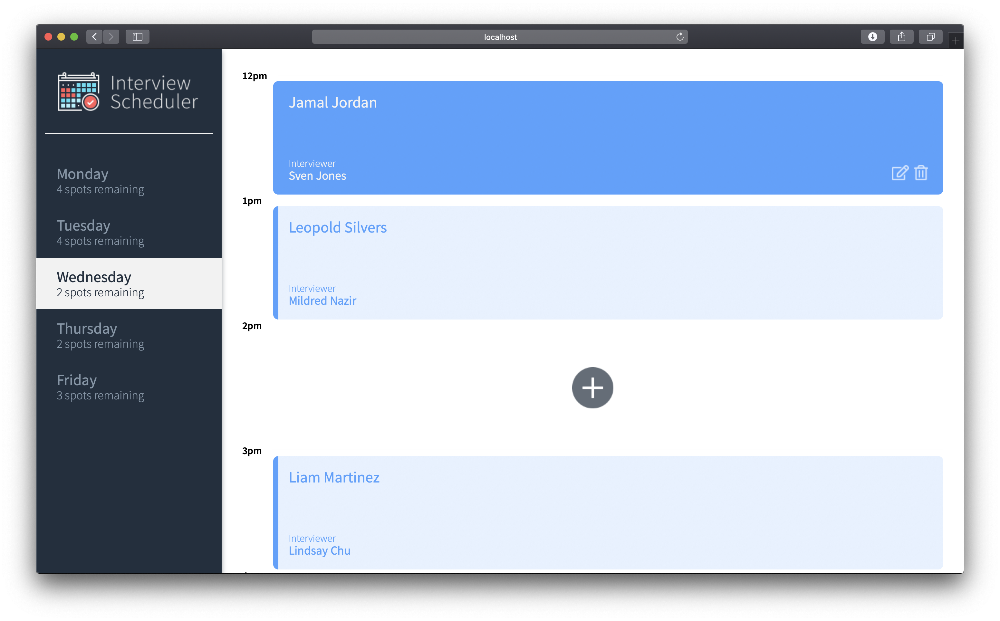
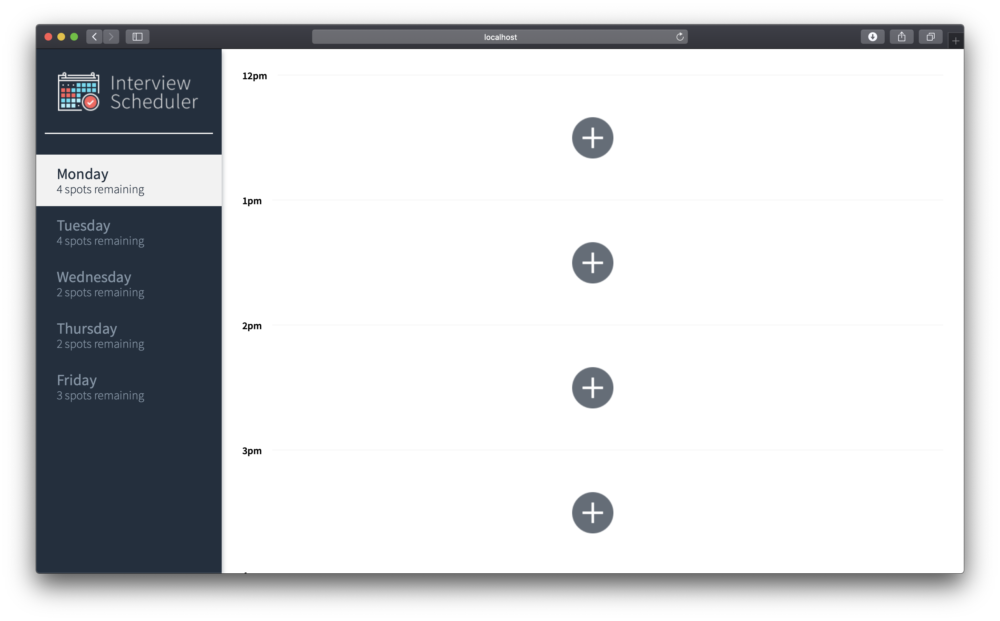
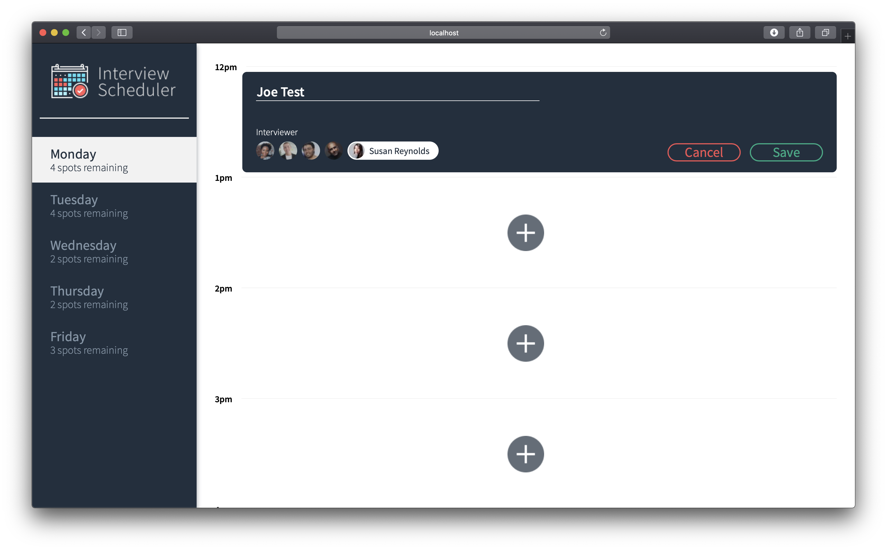

# Interview Scheduler

A full stack web app built mainly with ReactJS, using Axios, HTML, and CSS. One page application functionality.

## Setup

Install dependencies with `npm install`.
Use scheduler-api for database access. [Github Repo](https://github.com/arianrah/scheduler-api)

## Running Webpack Development Server

```sh
npm start
```

## Running Jest Test Framework

```sh
npm test
```

## Running Storybook Visual Testbed

```sh
npm run storybook
```

## Running CYPRESS testing

```sh
npm run cypress
```

## Screenshots




